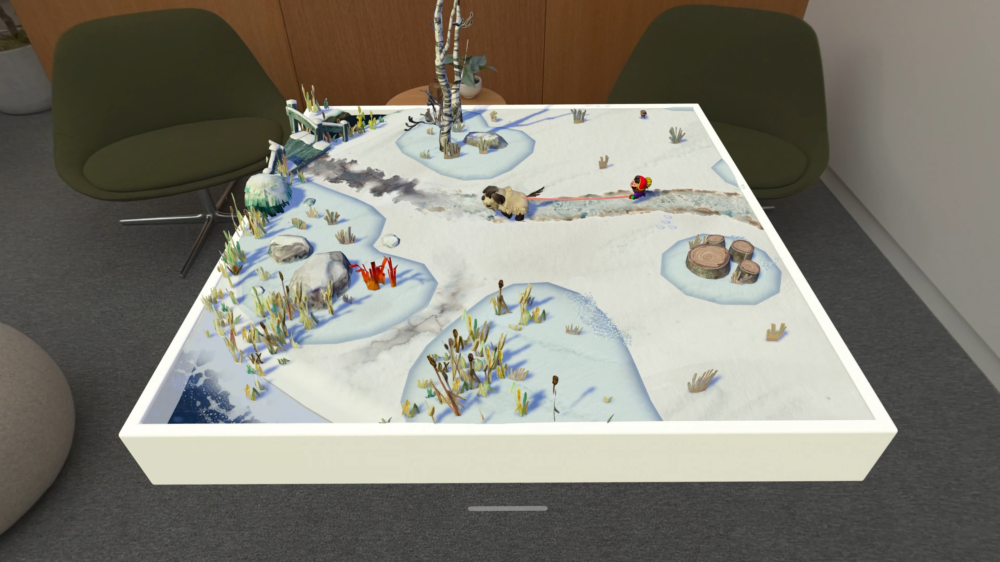

# GodotRealityKit

A GDExtension for the [Godot](https://godotengine.org/) game engine that renders with [RealityKit](https://developer.apple.com/documentation/realitykit) on visionOS. Build your game in Godot, then run it on Apple Vision Pro.

## visionOS

When bringing your Godot game to visionOS, you have the choice between various technologies:

1. [Monoscopic Metal view](https://developer.apple.com/documentation/quartzcore/cametallayer):
displays your Godot game on a 2D texture in a visionOS window.

2. [CompositorServices](https://developer.apple.com/documentation/compositorservices):
similar to [Godot's XR support](https://docs.godotengine.org/en/stable/tutorials/xr/setting_up_xr.html) on other platforms.

3. [RealityKit](https://developer.apple.com/documentation/realitykit/): RealityKit handles rendering instead of Godot,
which enables a deeper integration into visionOS. This is the mode covered by GodotRealityKit.

Here is a table that can help you pick the right technology for your game:

| Capability | RealityKit | CompositorServices | Monoscopic Metal view |
| -- | -- | -- | -- |
| [Windows](https://developer.apple.com/design/human-interface-guidelines/windows#visionOS) | stereoscopic | ◻ | monoscopic |
| [Volumes](https://developer.apple.com/design/human-interface-guidelines/windows#visionOS) | ☑️ | ◻ | ◻ |
| [Immersive](https://developer.apple.com/design/human-interface-guidelines/immersive-experiences) | ☑️ | ☑️ | ◻ |
| Renderer | RealityKit | Godot's Metal Rendering Driver | Godot's Metal Rendering Driver |
| Keyboard & Classic Game Controller input | ☑️ | ☑️ | ☑️ |
| Hand Tracking & Spatial Controllers | ☑️ | ☑️ | ◻ |
| [Spatial Gestures](https://developer.apple.com/documentation/swiftui/spatialeventgesture) | ☑️ | ☑️ | ◻ |

For more details about Windows, Volumes and Immersive Spaces on visionOS, see [Apple's visionOS developer site](https://developer.apple.com/visionos/).

Most of your game (for example, animations, simulation, and scripting) still runs in Godot. The difference
between those modes is in the rendering and the presentation style. You can change between modes
during development.

## Table of Contents

- [Building GodotRealityKit](./documentation/Building.md)
- [Adding the Plugin to your Game](./documentation/AddingPlugin.md)
- [Rendering](./documentation/Rendering.md)
- [Nodes from the plugin](./documentation/Nodes.md)
- [Settings](./documentation/Settings.md)
- [Troubleshooting](./documentation/Troubleshooting.md)