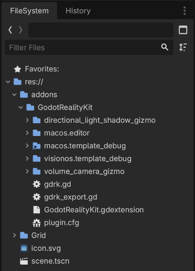
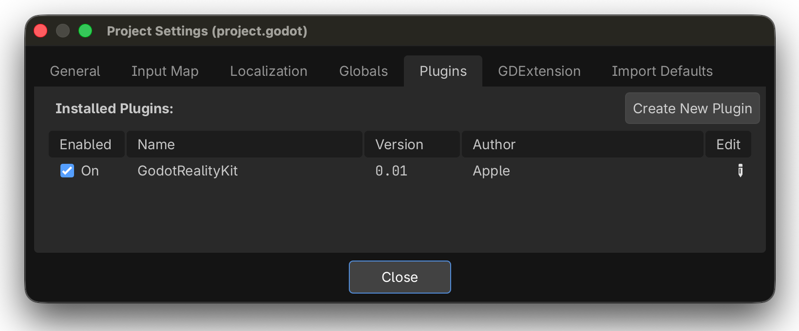
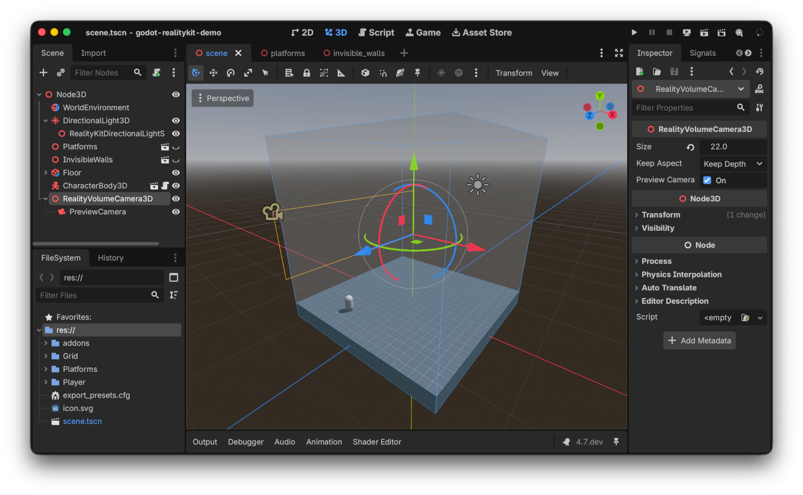
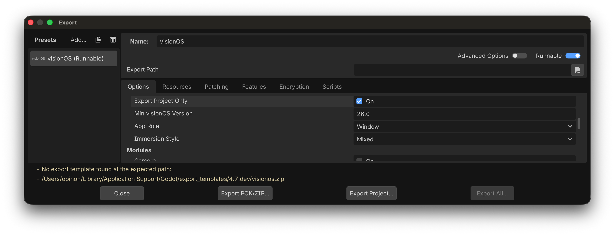
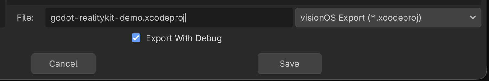
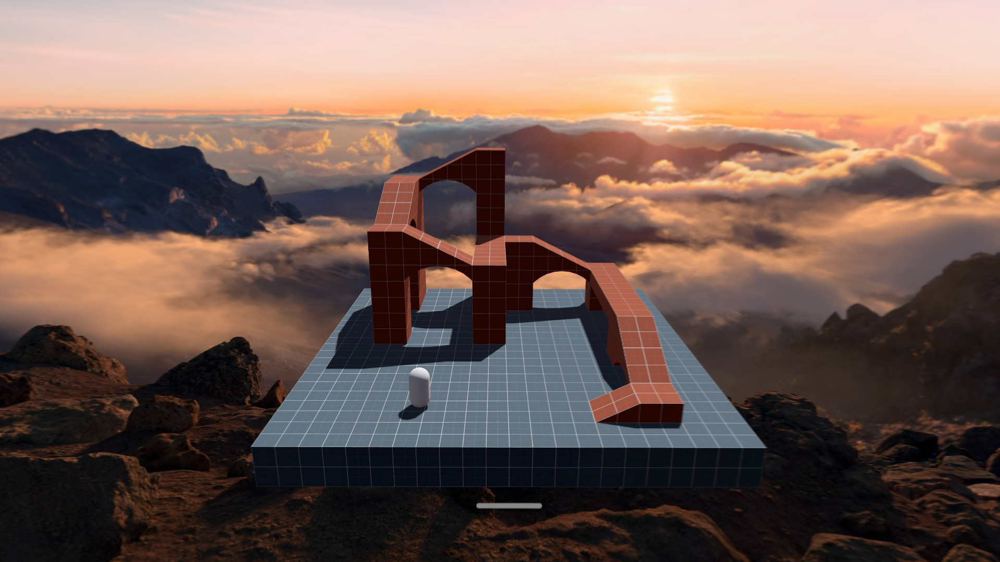

## Adding the Plugin to Your Game

### Open the Godot editor

Open the Godot editor that was built in `/out/shared_workspace/deps/debug/godot/bin/`.

_Note_: You can use a different editor if you need to, but it is important that GodotRealityKit was built
with the same version of Godot, as it uses a lot of different Godot APIs and might break otherwise.

### Copy the addon into your project

Copy the built `GodotRealityKit/` into your Godot project's `addons/` directory. Create the `addons/` directory if it doesn't already exist.

The structure of the `addons/` directory should look like so:

### Reload the project

Open your Godot project with the editor above, or click **Project > Reload Current Project** if it was already open.

You should see GodotRealityKit in the list of plugins:

A good way to verify that GodotRealityKit has been loaded is to add a `RealityVolumeCamera3D` to your scene:
it should display a blue box gizmo.

## Exporting to visionOS

### Open the export dialog

Open **Project > Export** in the Godot editor.

If there isn't already a visionOS preset, click **Add…** under **Presets** and select **visionOS**.

### Set a custom export template

Enable **Advanced Options** and set a custom export template to:

| Mode | Template Path |
| -- | -- |
| Debug | `./addons/GodotRealityKit/visionos.template_debug/godot_visionos.zip` |
| Release | `./addons/GodotRealityKit/visionos.template_release/godot_visionos.zip` |

You only need one of the two (Debug or Release), as long as it matches the **Export with Debug** setting used when exporting (see "Export the project" below).

This is to make sure that the Godot runtime (the export template) matches the version
that GodotRealityKit was built with.

### Configure the app role and bundle settings

Set **Application > App Role** to **Window** (not Immersive, which uses CompositorServices).

Do one of the following:
- Set your **Bundle Identifier** and **App Store Team ID**.
- Or enable **Export Project Only** to configure signing in Xcode later.

### Export the project

Click **Export Project** and select a directory where the Xcode project will be created.

Make sure that **Export with Debug** has the right value: it needs to match which
export template you set in "Set a custom export template", otherwise you get a compilation error in Xcode:

### Build in Xcode

Open the exported Xcode project and build it for Apple Vision Pro.

For example, here is what the sample above looks like on visionOS, rendering with RealityKit:

### Iterate on your Godot project

If you need to iterate on your Godot project, use **Export PCK/ZIP** instead
of **Export Project**: this preserves any change that you might have made
to the generated Xcode project.
