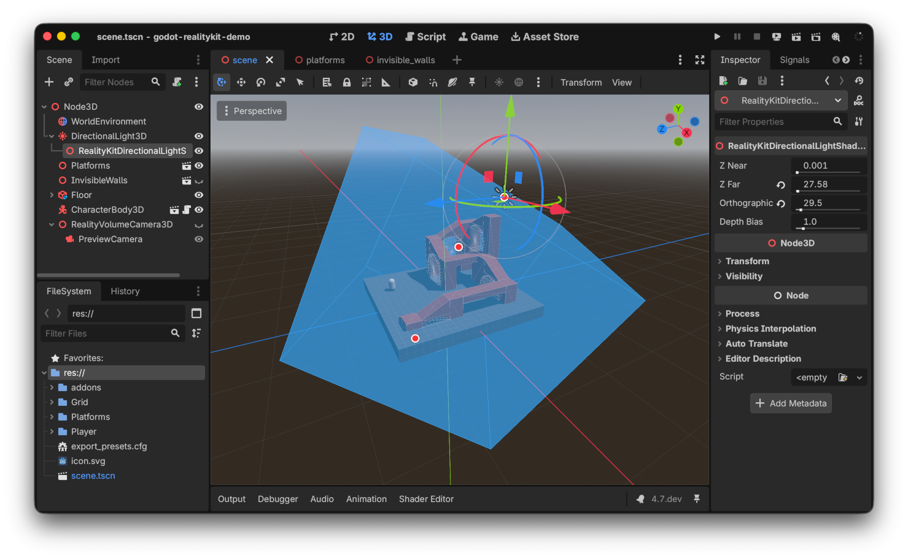

## Nodes

### RealityVolumeCamera3D


Defines a cube-shaped volume that maps into a visionOS volumetric window. Place it in your scene and everything inside the volume is rendered in the window.

- **size** — Size of the volume in Godot units (default: 5.0).
- **keep_aspect** — Which axis to preserve when the window aspect ratio changes: `KEEP_WIDTH`, `KEEP_HEIGHT`, or `KEEP_DEPTH`.
- **preview_camera_enabled** — When true, generates a preview Camera3D in the editor so you can see what the volume contains.

The node provides camera-like projection methods (`project_position`, `project_ray_origin`, `project_ray_normal`, `unproject_position`) for converting between screen and world coordinates.

Use this node for **Volumetric Window** presentation. For **Immersive** mode, use `XROrigin3D` instead.

### RealityHoverEffect3D

Add as a child of any `Node3D` to give it a visual hover effect when the user looks at it on visionOS. Wraps RealityKit's `HoverEffectComponent`.

- **style** — `Highlight` (default) or `Spotlight`.
- **strength** — Intensity of the effect (default: 1.0).
- **color** — Custom color for the effect, used when `color_enabled` is true.
- **color_enabled** — Whether to use the custom color or the default system color.

```
MyMeshInstance3D
  +-- RealityHoverEffect3D
```

### RealityPortalMeshInstance3D

Creates a portal in the shape of the assigned mesh. The portal reveals a separate world defined by `target_node` and its descendants. Wraps RealityKit's `PortalComponent`.

- **target_node** — Path to the root node of the world visible through the portal.
- **clipping_plane_enabled** — Whether to clip the portal world at a plane.
- **clipping_plane_position** — Position of the clipping plane.
- **clipping_plane_normal** — Normal of the clipping plane.
- **crossing_plane_enabled** — Whether objects can cross through the portal (use with `RealityPortalCrossing3D`).
- **crossing_plane_position** — Position of the crossing plane.
- **crossing_plane_normal** — Normal of the crossing plane.

### RealityPortalCrossing3D

Add as a child of a node that crosses through a `RealityPortalMeshInstance3D`. Controls how the node renders as it transitions between the real world and the portal world. Wraps RealityKit's `PortalCrossingComponent`.

```
Root
  +-- RealityPortalMeshInstance3D (target_node -> MyPortalScene)
  +-- MyPortalScene
        +-- MovingObject
              +-- RealityPortalCrossing3D
```

### RealityImageBasedLight3D

Defines ambient image-based lighting for a node and its descendants. Similar to `WorldEnvironment`, but scoped to a subtree rather than the entire scene. Wraps RealityKit's `ImageBasedLightComponent`.

- **environment** — An `Environment` resource defining the lighting.

```
MySubScene
  +-- RealityImageBasedLight3D (with environment)
  +-- MeshInstance3D  (lit by the IBL above)
```

### RealityKitDirectionalLightShadow3D



Add as a child of a `DirectionalLight3D` to use fixed orthographic shadow projection instead of the default automatic projection that fits the shadow map to the camera frustum.

- **orthographic_scale** — Width and height of the shadow projection box in meters (default: 10.0).
- **z_near** — Near clipping distance of the shadow projection in meters.
- **z_far** — Far clipping distance of the shadow projection in meters.
- **depth_bias** — Bias to reduce shadow acne (default: 1.0).

```
DirectionalLight3D
  +-- RealityKitDirectionalLightShadow3D
```

## Input Events

GodotRealityKit provides spatial input events that extend Godot's standard touch events with visionOS-specific data.

To handle these events, connect to a `CollisionObject3D`'s [`input_event`](https://docs.godotengine.org/en/stable/classes/class_collisionobject3d.html#class-collisionobject3d-signal-input-event) signal (or override the `_input_event` method). The event arrives as the `event` argument; use the spatial properties below instead of the `event_position` parameter.

### InputEventSpatialTouch

Extends `InputEventScreenTouch` with spatial data from visionOS. Maps to SwiftUI's `SpatialEventCollection.Event`.

- **world_position** — Position of the touch in world space.
- **selection_ray_origin / selection_ray_direction** — The ray from the user's input source (hand, controller, or eye gaze).
- **input_device_pose_position / input_device_pose_orientation** — Hand or controller pose in world space.
- **chirality** — Which hand produced the event (`LEFT` or `RIGHT`), when applicable.

### InputEventSpatialDrag

Extends `InputEventScreenDrag` with the same spatial data as `InputEventSpatialTouch`, plus:

- **world_relative** — Movement delta in world space since the last drag event.

Example handler:

```gdscript
func _on_input_event(_camera, event, _position, _normal, _shape_idx):
    if event is InputEventSpatialTouch:
        print("Spatial touch at: ", event.world_position)
    elif event is InputEventSpatialDrag:
        print("Dragging, delta: ", event.world_relative)
```
