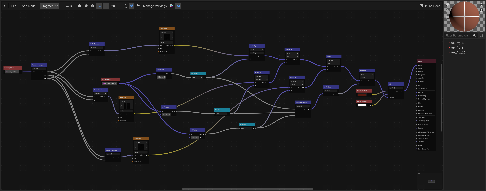

## Rendering

GodotRealityKit replaces Godot's renderer with RealityKit.

Here is a table keeping track of which rendering features are supported:

| Feature | RealityKit | Godot  |
| -- | -- | -- |
| Animated meshes | ☑️ | ☑️ |
| PBR materials | ☑️ | ☑️ |
| Shader Graphs | ☑️ | ☑️ |
| GLSL shaders | ◻ | ☑️ |
| Directional lights | ☑️ | ☑️ |
| Spotlights | ☑️ | ☑️ |
| Point lights | ☑️ | ☑️ |
| Shadowed point lights | ◻ | ☑️ |
| RealityKit portals | ☑️ | ◻ |
| visionOS hover effects | ☑️ | ◻ |

Note that some features are unique to RealityKit, in which
case GodotRealityKit exposes new nodes for them (such as [RealityPortalMeshInstance3D](./Nodes.md#realityportalmeshinstance3d)).

## Shaders

Godot's GLSL text shaders are **not** compatible with GodotRealityKit.

However, you can use Godot's Visual Shaders and they will be automatically converted
to RealityKit. Here is an example of a triplanar shader that works with GodotRealityKit:

