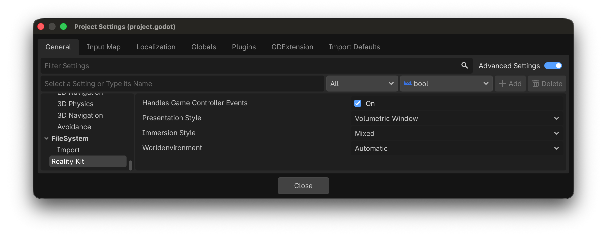

## Choose a presentation style

GodotRealityKit supports three presentation styles, configured in **Project > Project Settings > RealityKit > Presentation Style**:

- **Volumetric Window** (default) — Your game appears inside a resizable volume in your space. Use `RealityVolumeCamera3D` to define what part of your scene is visible.
- **Portal Window** — The window acts as a portal into your game world. The plugin reuses the project's perspective camera for the portal window.
- **Immersive** — Full immersive experience. Use `XROrigin3D` with the standard Godot XR workflow.

## Configure project settings

The plugin adds these settings under **Project > Project Settings > RealityKit**:

| Setting | Type | Default | Description |
|---|---|---|---|
| `reality_kit/presentation_style` | Enum | Volumetric Window | App presentation mode (Volumetric Window, Portal Window, Immersive) |
| `reality_kit/worldenvironment` | Enum | Automatic | World environment handling (Automatic, Enable, Disable) |
| `reality_kit/handles_game_controller_events` | Bool | true | Whether the app handles game controller input |
